# Mapa przejść między interfejsami użytkownika

```mermaid
graph TD
    %% Strony główne
    Login[login.astro] --> |"Zalogowano pomyślnie<br/>Ustawiono ciasteczka sesji"| Dashboard[index.astro]
    Register[register.astro] --> |"Zarejestrowano pomyślnie<br/>Utworzono nowe konto"| Dashboard
    CreateUser[create-user.astro] --> |"Utworzono użytkownika<br/>Przekierowanie do dashboardu"| Dashboard

    %% Generator fiszek
    Dashboard --> |"Kliknięto 'Generate Flashcards'<br/>Przejście do pierwszego kroku"| GeneratorInput[generator/input.astro]
    GeneratorInput --> |"Wprowadzono tekst (1000-10000 znaków)<br/>Wygenerowano fiszki"| GeneratorReview[generator/review.astro]
    GeneratorReview --> |"Zaakceptowano fiszki<br/>Przejście do zapisywania"| GeneratorSave[generator/save.astro]
    GeneratorSave --> |"Zapisano fiszki do kolekcji<br/>Powrót do dashboardu"| Dashboard

    %% Nauka
    Dashboard --> |"Kliknięto 'Start Study Session'<br/>Rozpoczęcie sesji nauki"| Study[study.astro]
    Study --> |"Zakończono sesję nauki<br/>Zapisano postępy"| Dashboard

    %% Komponenty React
    Study --> |"Renderuje główny komponent<br/>Inicjalizuje stan sesji"| StudySession[StudySession.tsx]
    StudySession --> |"Wyświetla aktualną fiszkę<br/>Obsługuje animacje"| FlashcardDisplay[FlashcardDisplay.tsx]
    StudySession --> |"Obsługuje interakcje użytkownika<br/>Przyciski akcji"| FlashcardControls[FlashcardControls.tsx]
    StudySession --> |"Pokazuje postęp sesji<br/>Licznik fiszek"| SessionProgress[SessionProgress.tsx]
    StudySession --> |"Obsługuje akcje sesji<br/>Pauza/Kontynuacja"| SessionActions[SessionActions.tsx]
    StudySession --> |"Wyświetla podsumowanie<br/>Statystyki sesji"| SessionSummary[SessionSummary.tsx]

    %% Generator komponenty
    GeneratorInput --> |"Renderuje formularz<br/>Obsługuje wprowadzanie tekstu"| GeneratorPage[GeneratorPage.tsx]
    GeneratorPage --> |"Formularz wprowadzania<br/>Walidacja tekstu"| GeneratorInputPage[GeneratorInputPage.tsx]
    GeneratorPage --> |"Lista wygenerowanych fiszek<br/>Możliwość edycji"| FlashcardReviewPage[FlashcardReviewPage.tsx]
    GeneratorPage --> |"Podsumowanie generowania<br/>Statystyki"| GeneratorSummaryPage[GeneratorSummaryPage.tsx]

    %% Layout
    Login --> |"Używa wspólnego layoutu<br/>Nagłówek i stopka"| Layout[Layout.astro]
    Register --> |"Używa wspólnego layoutu<br/>Nagłówek i stopka"| Layout
    Dashboard --> |"Używa wspólnego layoutu<br/>Nagłówek i stopka"| Layout
    Study --> |"Używa wspólnego layoutu<br/>Nagłówek i stopka"| Layout
    GeneratorInput --> |"Używa wspólnego layoutu<br/>Nagłówek i stopka"| Layout
    GeneratorReview --> |"Używa wspólnego layoutu<br/>Nagłówek i stopka"| Layout
    GeneratorSave --> |"Używa wspólnego layoutu<br/>Nagłówek i stopka"| Layout

    %% Middleware i autoryzacja
    Login --> |"Sprawdza autoryzację<br/>Weryfikuje sesję"| AuthMiddleware[middleware/index.ts]
    Register --> |"Sprawdza autoryzację<br/>Weryfikuje sesję"| AuthMiddleware
    Dashboard --> |"Sprawdza autoryzację<br/>Weryfikuje sesję"| AuthMiddleware
    Study --> |"Sprawdza autoryzację<br/>Weryfikuje sesję"| AuthMiddleware
    GeneratorInput --> |"Sprawdza autoryzację<br/>Weryfikuje sesję"| AuthMiddleware
    GeneratorReview --> |"Sprawdza autoryzację<br/>Weryfikuje sesję"| AuthMiddleware
    GeneratorSave --> |"Sprawdza autoryzację<br/>Weryfikuje sesję"| AuthMiddleware

    %% Supabase i sesja
    AuthMiddleware --> |"Używa klienta Supabase<br/>Zarządza sesją"| SupabaseServer[supabase/server.ts]
    Login --> |"Używa klienta Supabase<br/>Logowanie"| SupabaseServer
    Register --> |"Używa klienta Supabase<br/>Rejestracja"| SupabaseServer
    Dashboard --> |"Używa klienta Supabase<br/>Pobieranie danych"| SupabaseServer

    %% Style
    classDef page fill:#f9f,stroke:#333,stroke-width:2px
    classDef component fill:#bbf,stroke:#333,stroke-width:2px
    classDef layout fill:#bfb,stroke:#333,stroke-width:2px
    classDef middleware fill:#fbb,stroke:#333,stroke-width:2px

    class Login,Register,Dashboard,Study,GeneratorInput,GeneratorReview,GeneratorSave page
    class StudySession,FlashcardDisplay,FlashcardControls,SessionProgress,SessionActions,SessionSummary,GeneratorPage,GeneratorInputPage,FlashcardReviewPage,GeneratorSummaryPage component
    class Layout layout
    class AuthMiddleware,SupabaseServer middleware
```

## Legenda

### Typy węzłów
- **Różowy (page)**: Strony Astro
- **Niebieski (component)**: Komponenty React
- **Zielony (layout)**: Wspólny layout
- **Czerwony (middleware)**: Middleware i serwery

### Przepływy
1. **Uwierzytelnianie**
   - Logowanie i rejestracja
   - Zarządzanie sesją
   - Middleware autoryzacji

2. **Generator fiszek**
   - Trzyetapowy proces
   - Walidacja danych
   - Zarządzanie stanem

3. **Sesja nauki**
   - Interaktywne komponenty
   - Zarządzanie postępem
   - Podsumowanie wyników

4. **Layout i middleware**
   - Wspólny układ strony
   - Obsługa autoryzacji
   - Integracja z Supabase 