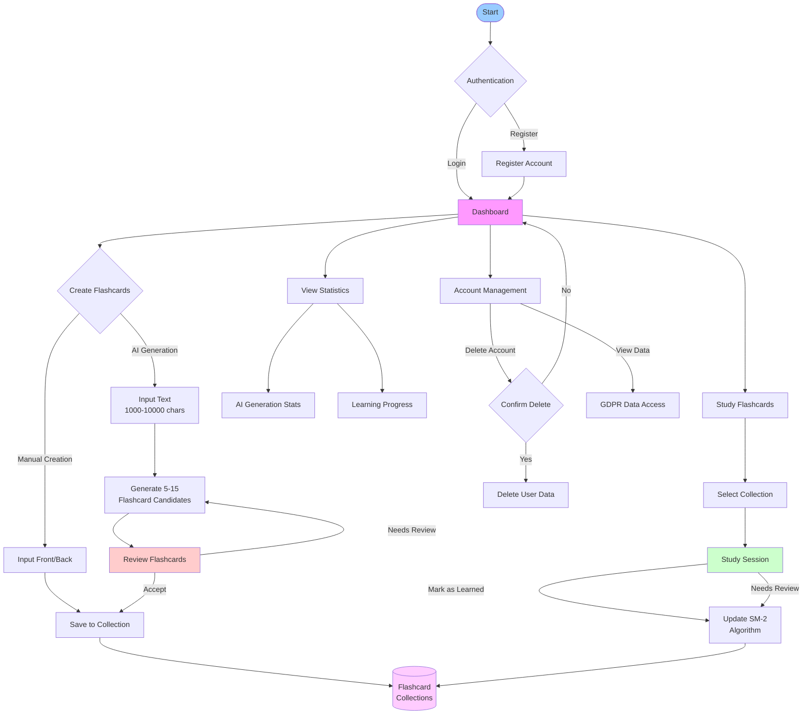

# Flow Diagram - 10xDevFiszki

```mermaid
flowchart TD
    Start([Start]) --> Auth{Authentication}
    Auth -->|Login| Dashboard
    Auth -->|Register| Register[Register Account]
    Register --> Dashboard

    Dashboard --> CreateFlashcards{Create Flashcards}
    Dashboard --> StudyFlashcards[Study Flashcards]
    Dashboard --> ViewStats[View Statistics]
    Dashboard --> AccountMgmt[Account Management]

    CreateFlashcards -->|AI Generation| AIInput[Input Text\n1000-10000 chars]
    CreateFlashcards -->|Manual Creation| ManualInput[Input Front/Back]

    AIInput --> AIGeneration[Generate 5-15\nFlashcard Candidates]
    AIGeneration --> Review[Review Flashcards]

    ManualInput --> SaveFlashcard[Save to Collection]

    Review -->|Accept| SaveFlashcard
    Review -->|Needs Review| AIGeneration

    SaveFlashcard --> Collections[(Flashcard\nCollections)]

    StudyFlashcards --> SelectCollection[Select Collection]
    SelectCollection --> StudySession[Study Session]
    StudySession -->|Mark as Learned| UpdateSM2[Update SM-2\nAlgorithm]
    StudySession -->|Needs Review| UpdateSM2
    UpdateSM2 --> Collections

    ViewStats --> GenerationStats[AI Generation Stats]
    ViewStats --> LearningStats[Learning Progress]

    AccountMgmt -->|Delete Account| Confirmation{Confirm Delete}
    Confirmation -->|Yes| DeleteData[Delete User Data]
    Confirmation -->|No| Dashboard
    AccountMgmt -->|View Data| GDPR[GDPR Data Access]

    style Start fill:#9cf
    style Dashboard fill:#f9f
    style Collections fill:#fcf
    style StudySession fill:#cfc
    style Review fill:#fcc
```

---

This diagram presents the main user flows in the 10xDevFiszki app according to the PRD. 