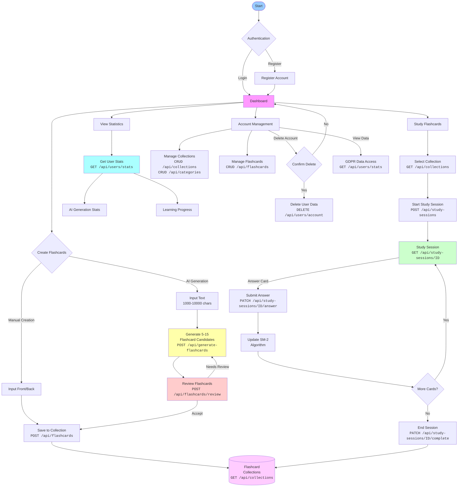

# Flow Diagram - 10xDevFiszki

## API Coverage Summary

| Function | API Endpoints | Status |
|----------|---------------|---------|
| **Authentication** | Supabase Auth | ✅ Covered |
| **Collections Management** | `CRUD /api/collections` | ✅ Covered |
| **Categories Management** | `CRUD /api/categories` | ✅ Covered |
| **Manual Flashcard Creation** | `POST /api/flashcards` | ✅ Covered |
| **AI Flashcard Generation** | `POST /api/generate-flashcards` | ✅ Covered |
| **AI Flashcard Review** | `POST /api/flashcards/review` | ✅ Covered |
| **Flashcard Management** | `CRUD /api/flashcards` | ✅ Covered |
| **Study Session Start** | `POST /api/study-sessions` | ✅ Covered |
| **Study Session Progress** | `GET /api/study-sessions/{id}` | ✅ Covered |
| **Submit Answers** | `PATCH /api/study-sessions/{id}/answer` | ✅ Covered |
| **End Study Session** | `PATCH /api/study-sessions/{id}/complete` | ✅ Covered |
| **User Statistics** | `GET /api/users/stats` | ✅ Covered |
| **Account Deletion** | `DELETE /api/users/account` | ✅ Covered |
| **GDPR Data Access** | `GET /api/users/stats` | ✅ Covered |

## Additional API Features

### Pagination & Filtering
- All `GET` endpoints support pagination (`limit`, `offset`)
- Flashcards filtering by collection, category, due status
- Collections and categories sorting options

### Error Handling
- Consistent error format across all endpoints
- Proper HTTP status codes (400, 401, 404, 409, 422, 429)
- Detailed validation error messages

### Rate Limiting
- AI Generation: 10 req/min per user
- Standard CRUD: 100 req/min per user
- Study Sessions: 5 concurrent active sessions

---

This diagram shows complete API coverage for all PRD functionalities with concise endpoint labels. 